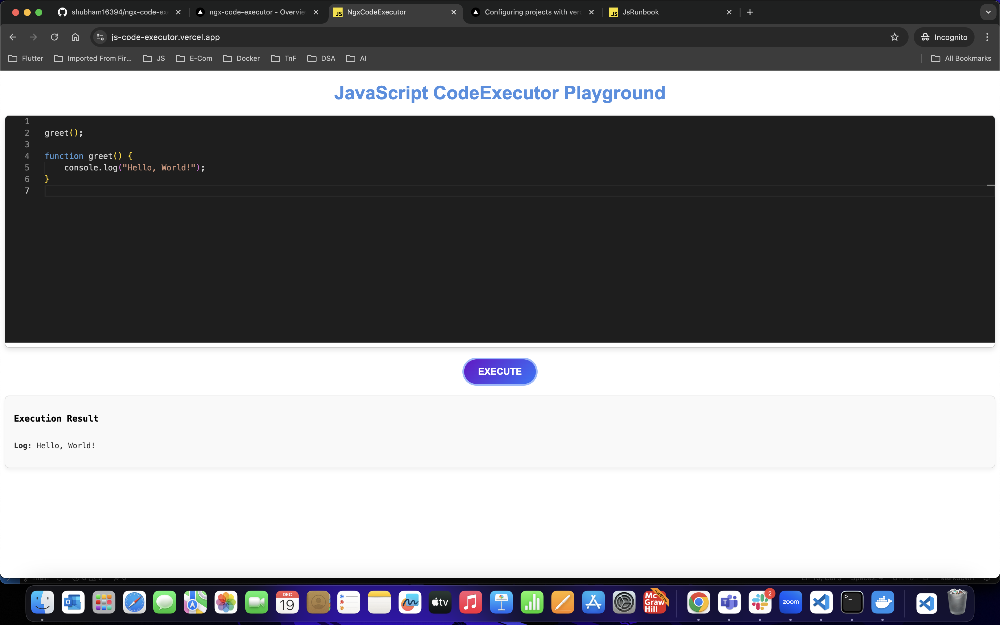

# JavaScript Code Executor

**[Live Demo](https://js-code-executor.vercel.app)**

Welcome to the **JavaScript Code Executor**, an online platform that allows you to run and test any JavaScript code in your browser without the need for any local setup. Whether you're learning JavaScript, testing small snippets, or just experimenting with code, this tool is here to make your experience smooth and efficient.

---

## Features ✨

- **Run Any JavaScript Code**: Simply paste your JavaScript code and execute it instantly.
- **Real-Time Feedback**: See the output of your code as soon as you run it.
- **Easy to Use**: Clean and minimalistic UI for an intuitive experience.
- **Instant Execution**: No need for setup or configurations. Just write your code and hit Execute.
- **Cross-Browser Compatible**: Works seamlessly on modern browsers.

---

## How It Works 

1. **Input**: Write or paste your JavaScript code into the provided text area.
2. **Execution**: Click on the 'Execute' button to execute the code.
3. **Output**: View the results instantly in the Execution Result section.

---

## Screenshots

---

## Why Use JavaScript Code Executor?

- **Practice & Learn**: Ideal for beginners to experiment with JavaScript.
- **Quick Prototyping**: Run code snippets quickly without setting up an environment.
- **Debugging**: Test and debug small code sections without running a full project.
- **No Local Setup**: Forget about installing compilers or setting up environments – just visit the site and start coding!

---

## How to Use 📚

1. **Visit the website**: Go to [https://js-code-executor.vercel.app](https://js-code-executor.vercel.app).
2. **Write or paste your JavaScript code** into the input area.
3. **Click the "Execute" button** to execute your code.
4. **View the results** in the Execution Result section.

It's that simple!

---

## Technologies Used

- **Frontend**: Angular, HTML, CSS
- **Backend**: None (Fully client-side)
- **Libraries & Tools**: 
  - Angular (for UI components)
  - Vercel (for hosting)

---

## Contributing 🤝

We welcome contributions to improve the project, add new concepts, fix bugs, or enhance existing features!

To contribute:

1. **Fork** the repository.
2. **Clone** your fork to your local machine.
3. **Create a branch** for your feature/fix.
4. **Make changes** and test your changes locally.
5. **Commit** your changes and push to your fork.
6. Open a **Pull Request (PR)** with a clear description of the changes.

We review PRs regularly and will merge them if they meet the project’s requirements.

---

## Connect with Me 💻

- Follow me on Instagram: [@codhing_with_shubham](https://www.instagram.com/codhing_with_shubham) for exciting tech content and updates.
- Subscribe to my YouTube channel: [@codhingwithshubham](https://www.youtube.com/@codhingwithshubham) where I will be sharing **amazing content** related to tech, coding tutorials, tips, and more!

Feel free to connect with me and join the growing community of tech enthusiasts! 😊

---

## License 📄

This project is open-source and available under the [MIT License](LICENSE).

---

Happy Coding! ✨
